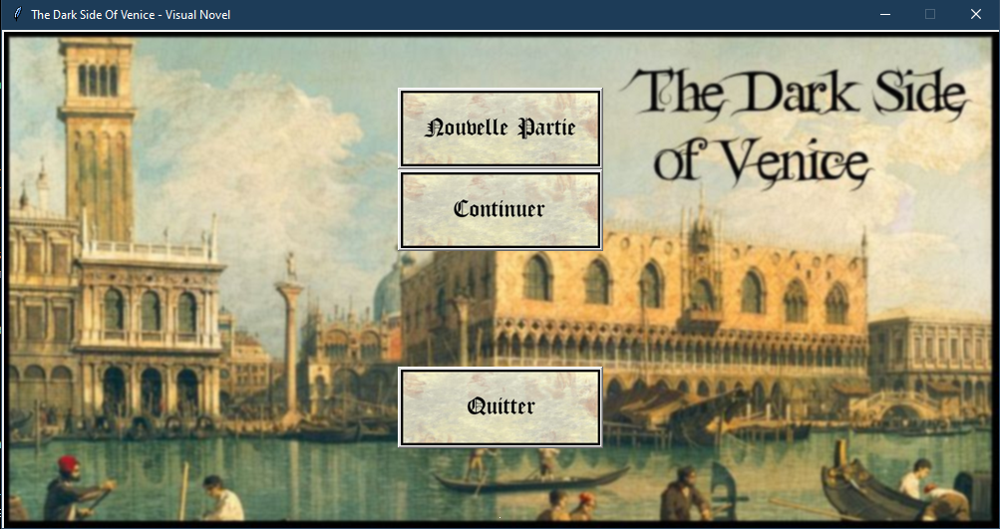
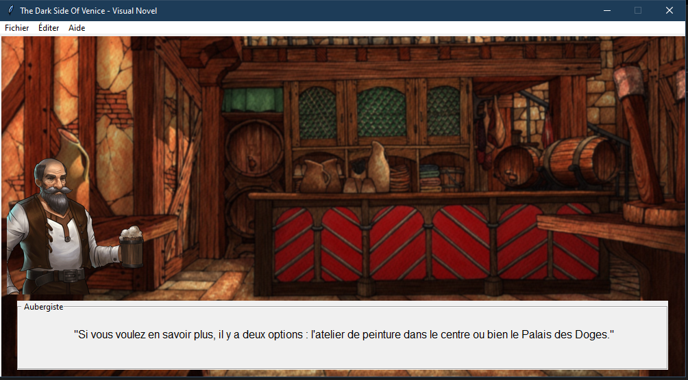

# The Dark Side Of Venice - Visual Novel

## Description

The Dark Side Of Venice - Visual Novel est un mini-projet réalisé dans le cadre de l'enseignement de NSI en Terminale.
Il a pour but de créer un jeu -un visual novel- en Python.
Voici l'énoncé : Il s'agit de programmer le déroulement d'une histoire dans le style "L'histoire dont vous êtes le héros". La programmation se fera en python en utilisant une structure arborescente (arbre binaire), la programmation orientée objet (avec une classe) et une fonction récursive.

Ce jeu repose sur l'utilisation d'un arbre binaire, créé à partir d'une classe Arbre, qui contient des noms de fichiers textes. Ces fichiers textes sont lus par un programme qui les interprète en lignes de dialogues, arrières plans... qui sont ensuite affichés grâce au fichier gui.py.

## Histoire

Le carnaval de Venise est vraiment magnifique, il y rassemble des personnes venant de tout le pays et de toutes les classes. Il s'agit d'un moment de joie et de repos pour tout le monde. Pourtant, depuis les ombres, un complot se trame. Arriverez vous à déjouer le complot et à survivre aux dangers de cette ville ?

## Images du jeu

Il est temps de commencer l'aventure !


Les personnages vous aideront à résoudre l'enquête, sous certaines conditions...


Faites les bons choix et le destin vous mènera au bon endroit.


## Installation

### Téléchargement

Vous pouvez télécharger le code sous format `.ZIP` ou bien en clonant le projet dans le répertoire actuel :

```sh
git clone https://github.com/Taliayaya/visual_novel.git
```

### Prérequis

Python doit impérativement être installé. Dans une console, placez-vous dans le répertoire du projet. Lancez l'instruction

```sh
pip install .
```

ou son équivalent

```sh
python3 -m pip install .
```

ou bien

```sh
make init
```

### Lancer le jeu

Lancez l'instruction :

```sh
python3 visual_novel/
```

ou bien

```sh
make run
```

## Crédits

L'histoire et les musiques ont été écrites et composées par Irène Fioc. Les sons sont sous Royalty Free.

## Licences

Copyright © 2022-présent, Ilan Mayeux et Irène Fioc.
Ce projet est sous licence GNU
